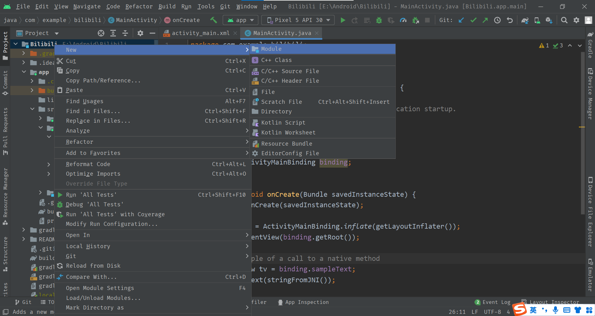

#### 项目介绍

项目名称：Bilibili

一个模仿bilibili的安卓视频播放器、每一步做了什么我都会写在这里，每一个功能是怎么实现的我也会记录下来，这份文档我会发布中文和英文版本到
https://github.com/zchancode
博客上面
https://zchancode.github.io
项目里面会用到许多技术如NDK Cmake 自定义View ffmpeg等等，写这个项目的目的是为了找到工作

#### 项目环境
```
Android Studio Chipmunk | 2021.2.1 Patch 2
Build #AI-212.5712.43.2112.8815526, built on July 10, 2022
Runtime version: 11.0.12+7-b1504.28-7817840 amd64
VM: OpenJDK 64-Bit Server VM by Oracle Corporation
Windows 10 10.0
GC: G1 Young Generation, G1 Old Generation
Memory: 4096M
Cores: 12
Registry: external.system.auto.import.disabled=true, debugger.watches.in.variables=false, ide.instant.shutdown=false, ide.images.show.chessboard=true
```
#### 创建项目

打开AndroidStudio创建NDK项目，C++ 工具链我选的C11版本


#### 配置Git

打开github这个连接，添加一个新的token，用于androidstudio，git还要配置ssh，配置用户名密码，邮箱，具体可以参考其他教程


#### 新建View库

这个库主要是用来自定义控件或者布局的，写在一起的话很乱

很容易，我不做多解释，至此我们所有环境都配置好了，只要写代码实现功能了，照着bilibili的ui写就是了
