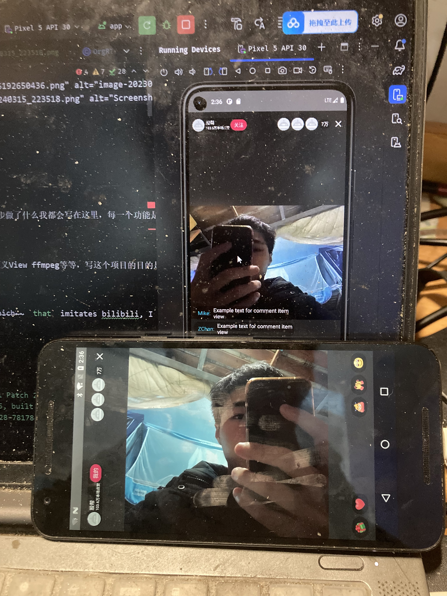
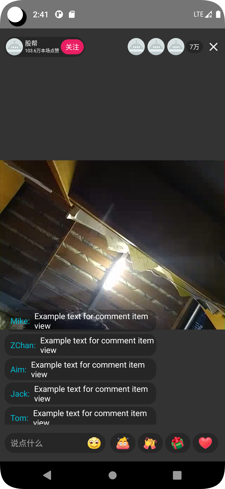
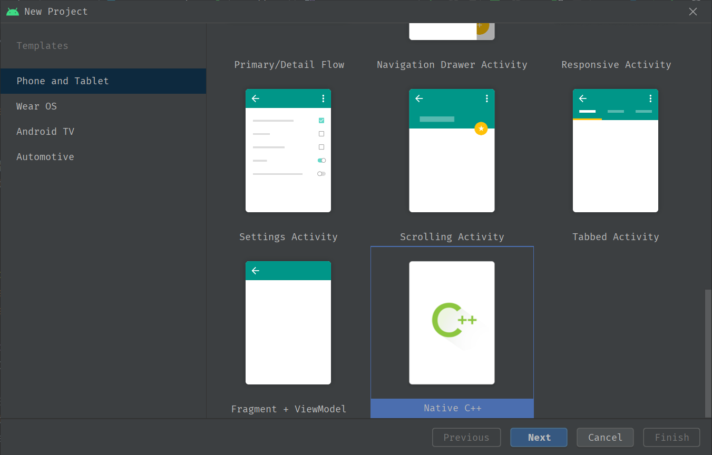
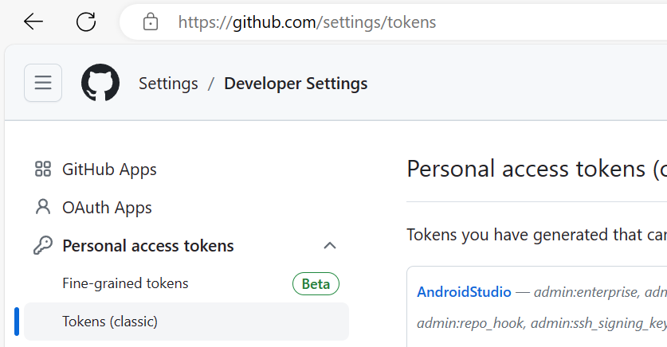
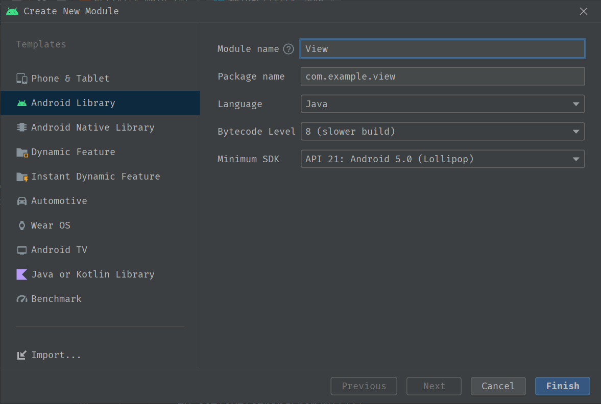

#### 项目截图（working）






#### 项目介绍

项目名称：Bilibili

一个模仿bilibili的安卓视频播放器、每一步做了什么我都会写在这里，每一个功能是怎么实现的我也会记录下来，这份文档我会发布中文和英文版本到
https://github.com/zchancode
博客上面
https://zchancode.github.io
项目里面会用到许多技术如NDK Cmake 自定义View ffmpeg等等，写这个项目的目的是为了找到工作

Project Name: Bilibili

It's an `android` video player ~~which~~ `that` imitates bilibili, I ~~could~~ will ~~jot down~~ `document`  every ~~single~~ step `i take`up here. ~~and~~ `as well as`  how ~~the~~ each function is to be implemented. I will jot down ~~up~~ here as well. The document I will `post` /`publish` ~~it~~  to my blog and github in English and Chinese `version`,the project will use ~~many~~ a bunch of  technolog`ies` ~~for example~~ like ndk cmake and custom view ffmpeg ~~etc~~ `and more`. Actually it's definitely for `enhancing the chances of finding a grate job`

#### 项目环境

#### Project Environment

```
Android Studio Chipmunk | 2021.2.1 Patch 2
Build #AI-212.5712.43.2112.8815526, built on July 10, 2022
Runtime version: 11.0.12+7-b1504.28-7817840 amd64
VM: OpenJDK 64-Bit Server VM by Oracle Corporation
Windows 10 10.0
GC: G1 Young Generation, G1 Old Generation
Memory: 4096M
Cores: 12
Registry: external.system.auto.import.disabled=true, debugger.watches.in.variables=false, ide.instant.shutdown=false, ide.images.show.chessboard=true
```
#### 创建项目

#### Create Project

打开AndroidStudio创建NDK项目，C++ 工具链我选的C11版本

Start AndroidStudio and then create an NDK peoject, I selected the C plus plus toolchan with C11



#### 配置Git

#### Config Git

打开github这个连接，添加一个新的token，用于androidstudio，git还要配置ssh，配置用户名密码，邮箱，具体可以参考其他教程

Open the link of github and add a new token for androidstudio, git need to ~~config~~ `configure ` ssh don't forget. ~~config~~ `set up` username and password or others.~~you can looking for on internet~~`For detailed instructions, you can refer to other tutorials` 



#### 新建View库

#### Create View Library

这个库主要是用来自定义控件或者布局的，写在一起的话很乱

Actually the library is for custom widgets or layout, it could be mass if you written them together



很容易，我不做多解释，至此我们所有环境都配置好了，只要写代码实现功能了，照着bilibili的ui写就是了

incredibly easy. I don't wanna explain any more. Finally, we have finished the process of config our environment, we `are` just following bilibili' design and code on there now


我们打开Bilibili，主界面采用了很多个fragment，很多选卡。简单来说，我们先得把主要的界面设计出来，说实话我很少做和fragment相关的内容，先看成果，整个界面都是参考bilibili

So we open bilibili,which use a bunch of  fragments in the 主界面 and many tabs that can be picked. basically, we should design the 主界面 first of all, honestly? I barely use fragment to do project, anyway looking for the following:


看起来是不是还不错，下面我一步一步的讲是怎么实现的。

looking great, and the I'm gonna say how it be realized/implemented

##### 实现底部的选卡 realize the tabs on the bottom

底部选卡采用的是ViewGroup，搞了五个TextView一开始想用GroupButton的但是我觉得配置xml没有我写一个ViewGroup快，好吧事实上我对xml配置不熟练我宁愿用java写代码，而且我可以自定义组件大小和layout的位置，外边距也很好配置，唯一的问题就是中间的按钮图片太小了，找了半天没找到这个反编译的图片。

the tabs in bottom I'm using ViewGroup, I made five textview on there, I had used GroupButton before.but i think it's better or 方便 If I use ViewGroup. Actually. I'm not 熟悉 So I 宁愿 using java to implement it. and I can custom 组件's size and location of layout, margin or padding is easy to configure as well. the only question is the size of the image in the center. I spend many time to find the approate? image

##### 实现fragment切换 realize 切换 of  fragment 

因为底部的控件都是我自定义的，所以写一个接口回调出选中哪一项即可，然后搞一个切换的函数

I custom the 控件 in the bottom, so I just need code an 接口 which can callback which 控件 be selected

```java
private void changeFragment(Fragment fragment) {
        FragmentManager FRAGMENT_MANAGER = getSupportFragmentManager();
        FragmentTransaction TRANSACTION = FRAGMENT_MANAGER.beginTransaction();
        TRANSACTION.replace(R.id.fragmentView, fragment);
        TRANSACTION.commit();
    }
```

##### 在fragment里面写一个tabview  realize a tabview on the fragment

```xml
<com.google.android.material.tabs.TabLayout
        android:id="@+id/homeTab"
        android:layout_width="match_parent"
        android:layout_height="wrap_content"
        app:tabGravity="fill"
        app:tabIndicatorColor="#FB7299"
        app:tabMode="scrollable"
        app:tabSelectedTextColor="#FB7299"
        app:tabTextColor="#999" />

    <androidx.viewpager.widget.ViewPager
        android:layout_marginTop="6dp"

        android:id="@+id/homeContent"
        android:layout_width="match_parent"
        android:layout_height="match_parent" />
```

这一部分是死的，代码都是固定的，最主要的就是写一个适配器，其他就是向适配器里添加内容，我还是说Adapter吧，中文是shit。

the part of code is 固定的, the most important part is how to implement an adapter. and than feed the content into adapter. 

```java
class MPagerAdapter extends FragmentPagerAdapter {
        public MPagerAdapter(FragmentManager fm) {
            super(fm);
        }
//construct
        @Override
        public Fragment getItem(int position) {
            return (Fragment) fragmentList.get(position);
        }
//override getItem function
        @Override
        public int getCount() {
            return fragmentList.size();
        }
//simple function getCount
        @Override
        public Object instantiateItem(ViewGroup container, int position) {
            return super.instantiateItem(container, position);
        }

        @Override
        public CharSequence getPageTitle(int position) {
            return temp[position];
        }
    }
```

别人已经写好了，加一两句就可以用，构造传入被重写的Fragment类。

they had been finished. we just 加几句 and It can be used. 将 fragment 传入Constrution function 

##### 之后就是把toolbar写出来 and than implement toolbar

toolbar我全是用原生LinearLayout水平布局，再搞几个边距，这个图片我一开始直接用的ImageView但是发现如果直接进行按比例分配宽度的话会被拉扯所以我就先用viewgroup就是线性布局先包裹了一层。然后让图片搞默认应宽度和高度，搜索框也是一个线性布局然后搞一个背景

toolbar I used orginal LinnearLayout horztal layout, we just set up some margin or padding. the image 显示渲染 I had used imageview before. and then i find? it be 拉扯 if i allocate the weind?. So I used viewgroup to 包裹 it

make the image 显示 defult wed and height.search box is same method as well 

```xml
<?xml version="1.0" encoding="utf-8"?>
<shape xmlns:android="http://schemas.android.com/apk/res/android"
    android:shape="rectangle">
    <corners android:radius="500dp"/>
    <stroke android:color="#CECECE" android:width="1dp"/>

</shape>
```

不过圆角这里我不知道设置多大，随便搞了一个500dp让他两边是圆的

其中输入框把底部的线隐藏掉用

but the radius i dont know how much the size is apporate?, So i 任意的 set up 500dp to make it has corners in 两端

and we need hide the input view'line

```sh
android:background="@null"
            android:textCursorDrawable="@drawable/shape_main_search_edittext_cursor"
           
```

第二句是我用来自定义光标的，改成粉的

the second line is used to custom cursor, change the color of cusor

##### 然后就是实现视频列表 and than realize the video list

直接用RecyclerView，这个可以一行显示两个，当然还有其他功能但是这种东西一般都要搜搜，面试别问这种，我只能说背了就会说，我没背

using RecyclerView 直接地, the kind这种 can 显示 two items in a line, actually there have many 功能 but I need looking for. find job dont ask me that. I have no words if i didn't 背

这种大致步骤就是，写一个adapter然后把adapter绑定到控件上面，当然要先初始化，关键的就是这个适配器怎么写，其实也简单就是重写几个方法

```java
package com.example.bilibili.adapter;

import android.content.Context;
import android.graphics.drawable.Drawable;
import android.view.LayoutInflater;
import android.view.View;
import android.view.ViewGroup;
import android.widget.Adapter;
import android.widget.ImageView;
import android.widget.TextView;

import androidx.annotation.NonNull;
import androidx.recyclerview.widget.RecyclerView;

import com.example.bilibili.R;

import java.util.ArrayList;

/**
 * Created by Mr.Chan
 * Time 2023-09-06
 * Blog https://www.cnblogs.com/Frank-dev-blog/
 */
public class VideoListAdapter extends RecyclerView.Adapter {
    public ArrayList<String> itemNameList, itemUpNameList;
    private Context context;
    public ArrayList<Drawable> itemPicList;

    public VideoListAdapter(Context context, ArrayList itemPicList, ArrayList itemNameList, ArrayList itemUpNameList) {
        this.context = context;
        this.itemPicList = itemPicList;
        this.itemNameList = itemNameList;
        this.itemUpNameList = itemUpNameList;
    }


    public class VideoHolder extends RecyclerView.ViewHolder {
        ImageView itemPic;
        TextView itemName, itemUpName;

        public VideoHolder(View itemView) {
            super(itemView);
            itemPic = itemView.findViewById(com.example.view.R.id.videoImage);
            itemName = itemView.findViewById(com.example.view.R.id.videoNameText);
            itemUpName = itemView.findViewById(com.example.view.R.id.videoUpText);
        }
    }

    @NonNull
    @Override
    public VideoHolder onCreateViewHolder(@NonNull ViewGroup parent, int viewType) {
        View view = LayoutInflater.from(context).inflate(com.example.view.R.layout.main_video_list_item, parent, false);
        return new VideoHolder(view);
    }


    @Override
    public void onBindViewHolder(@NonNull RecyclerView.ViewHolder holder, int position) {
        VideoHolder videoHolder = (VideoHolder) holder;
        videoHolder.itemPic.setImageDrawable(itemPicList.get(position));
        videoHolder.itemName.setText(itemNameList.get(position));
        videoHolder.itemUpName.setText(itemUpNameList.get(position));
    }

    @Override
    public int getItemCount() {
        return itemNameList.size();
    }
}

```

说实话我更喜欢C++,所以我计划后面可以用C++写我就用C++写，虽然没有java接触的时间长但是，这个写的有理有据，虽然java也有理有据但是我觉得这是脚本语言笨重，迟早会变成时代的抛弃品，C++才是世界上最好语言，还有栈内存和堆内存，算了扯远了

VideoListAdapter写一个重构用来初始化，其实这个adapter就是用来为每一个item赋值的然后把这些赋好值的控件传出去

onCreateViewHolder 把用holder存好的控件传给onBindViewHolder让他为每一个控件赋值然后这就是adapter

然后一行显示两个item

```java
RecyclerView.LayoutManager layoutManager = new GridLayoutManager(getContext(), 2);
        mRecyclerView.setLayoutManager(layoutManager);
      
```

然后配置配置间距和背景就好了
