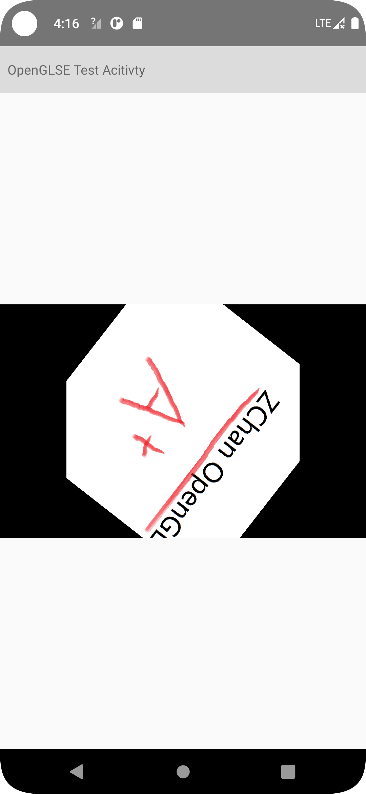

#### 结构介绍
**'zchan_ffrtmp'** - Main.cxx实现基于FFmpeg的RTMP推流功能  

**'zchan_ffrtmp_plus'** - 多文件编程Main.cxx AudioEncoder.cxx VideoEncoder.cxx PushQueue.cxx ...实现基于FFmpeg的RTMP推流功能  
**'zchan_librtmp'** - Main.cxx实现基于librtmp+faac+libx264的RTMP推流功能  
**'zchan_ffrtmp_plus'** - 多文件编程Main.cxx FaacEncoder.cxx X264Encoder.cxx ...实现基于librtmp+faac+libx264的RTMP推流功能  
**'zchan_opengl'** - stb_image.h实现图片加载功能，Main.cxx实现OpenGL渲染功能（画正方形，贴图，旋转）  
**'zchan_player'** - Main.cxx实现基于FFmpeg播放器  
**'zchan_player_plus'** - 多文件编程Main.cxx demux decode swr... 各个功能通过IObserver观察者模式实现基于FFmpeg播放器  
**'zchan_view'** - 仿Bilibili APP首页UI界面，和仿抖音直播间UI界面，和相关资源文件  

#### 项目截图（working）

